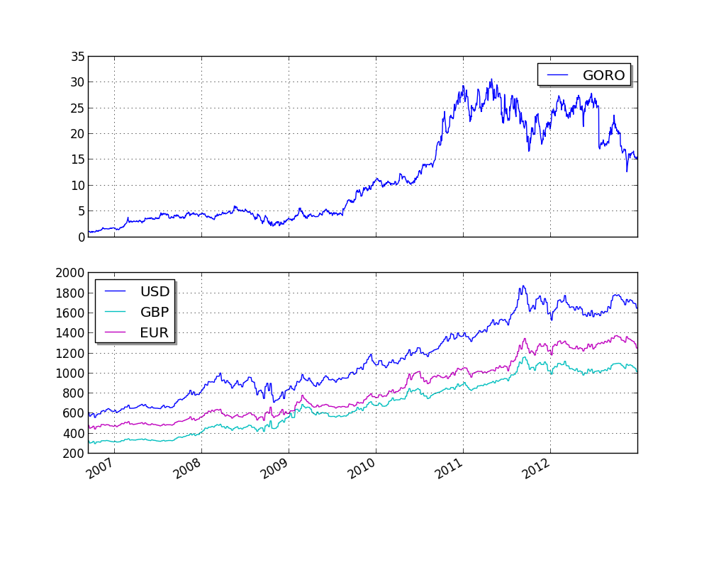

Quandl 合集
==================

The purpose of this example is to show how to integrate price data along with any
time-series data in CSV format from Quandl into a strategy.

We'll use the following CSV data from Quandl:
http://www.quandl.com/OFDP-Open-Financial-Data-Project/GOLD_2-LBMA-Gold-Price-London-Fixings-P-M

.. literalinclude:: ../samples/quandl_sample.py

本例输出结果如下:

.. literalinclude:: ../samples/quandl_sample.output

最终结果绘制如下图所示:

